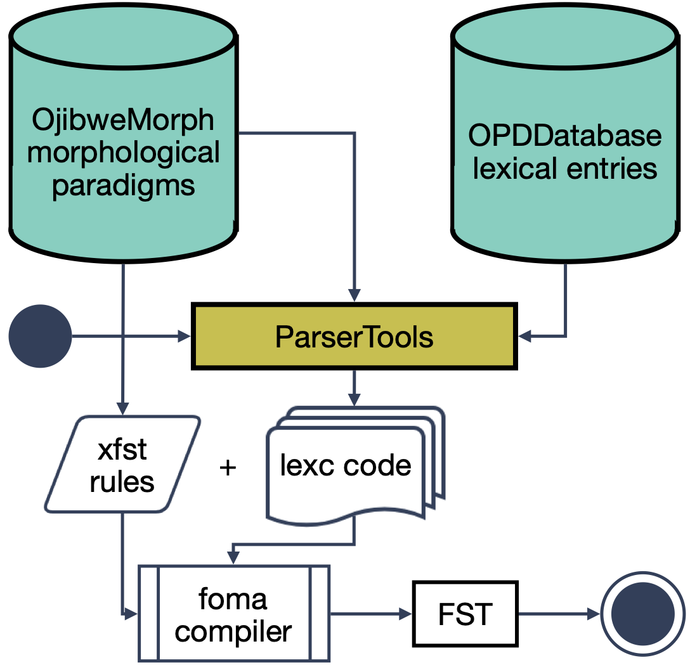

# Overview

This project builds FST morphological analyzers based on human-readable and human-editable inflection tables and lexical databases. 

A morphological analyzer is a model which can do two things:

* Analyze an inflected word as a combination of a lemma and morphological features: `walked -> walk+Verb+Past`
* Generate inflected forms from a lemma and some morphological features: `walk+Verb+Past -> walked`

Traditionally morphologocal analyzers are implemented as finite-state transducers (FST). These have been shown to adequately model the inflectional processes for most if not all human languages. Foma is one of the most popular tookits for compilation of FST morphological analyzers. It uses formalisms originally developed by Xerox to present lexical information (**lexc** formalism) and phonological rules (**xfst** formalism). The lexical component provides information about word stems like `bake` and affixes like `-ed`. The rule-component determines how stems and affixes are combined into word forms. For example, for the combination `bake+ed`, the rules might delete the `e` in the affix, thereby, giving a valid English word form: `bake+ed -> bake+d -> baked`.

Lexc lexicons tend to get quite messy and hard to maintain when the lexicon grows, especially for morphologically complex languages like many of the Indigenous languages of Canada and the US. Our project instead represents lexical information in a spreadsheet format which is easy to view, edit and maintain even without extensive technical experience. The aim is to make FST development accessible for a broader range of developers and community members who do not necessarily need to be professional linguists or computational linguists. 

Our spreadsheets are ultimately compiled into lexc code and then compiled into an FST model using the foma toolkit.  

## Overvivew of the compilation process

The FST analyzer is built using three source repositories:

* OjibweMorph houses morphological paradigms, skeleton lexc code and the xfst phonological rewrite rules (this repository either is already freely available or will short be made freely available for under a non-commerical license)
* OPDDatabase houses a lexical database from the Ojibwe People's Dictionary (this repository will not be made publicly available)
* ParserTools houses the code for compiling lexc files from the source data in OjibweMorph and OPDDatabase (this repository is publicly available and licensed under CC Deed)

We split the code into three different repositories mainly due to licensing issues. We want everyone to be able to use OjibweMorph and ParserTools together with their own lexical database for Ojibwe or a different Algonquian language.

The spreadhsheets, configuration files and xfst rules in OjibweMorph can be used to compile a very minimal FST which can analyze and generate the forms for twenty-odd Ojibwe model lexemes. For a full-scale morphological analyzer which can analyze most Ojibwe words in running text, we need to add a lexical database. We currently use OPDDatabase, but it would be possible to swap a different database in its place. For example, one which allows for commercial use. 

More precisely, the script `csv2lexc.py` in the ParserTools repo utilizes (1) morphological paradigms for nouns, verbs and other word classes from `OjibweMorph` (2) a database of lexical information from OPDDdatabase and (3) configuration files for compiling lexc code from OjibweMorph. It then generates a set of lexc-files which are combined with xfst rules manually specified in OjibweMorph using the foma toolkit. Ultimately, foma saves the result as an FST. The pipeline is depicted below:

## Additional topics

1. [Installation and running scripts](howto.md) 
2. [Intro to Ojibwe morphology](morphology.md) 
3. [Intro to FST morphology](fst.md)
4. [The OjibweMorph repo](ojibwemorph.md)
5. [The OPDDatabase repo](opddatabase.md)
6. [The ParserTools repo](parsertools.md)
7. [Useful references](references.md)
   
