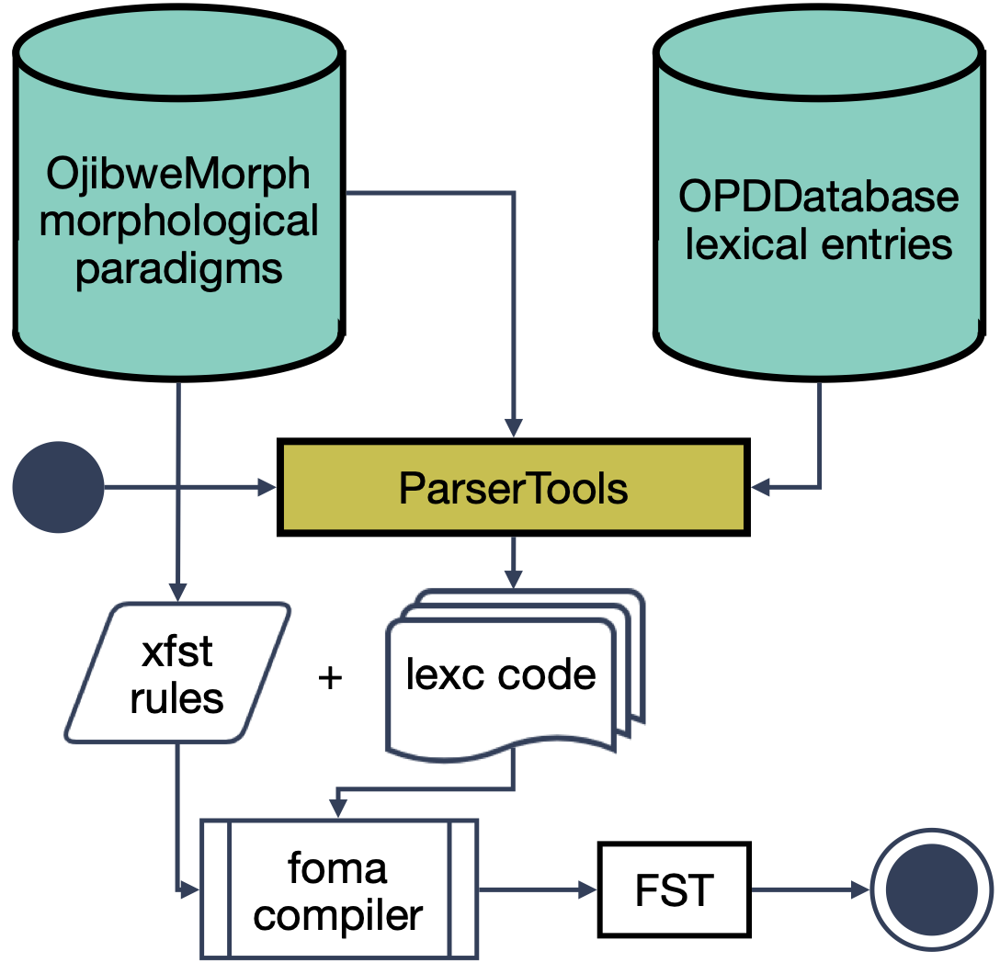

## Overvivew of the compilation process

The FST analyzer is built using three source repositories:

* OjibweMorph houses morphological paradigms, skeleton lexc code and the xfst phonological rewrite rules (this repository either is already freely available or will short be made freely available for under a non-commerical license)
* OPDDatabase houses a lexical database from the Ojibwe People's Dictionary (this repository will not be made publicly available)
* ParserTools houses the code for compiling lexc files from the source data in OjibweMorph and OPDDatabase (this repository is publicly available and licensed under CC Deed)

We split the code into three different repositories mainly due to licensing issues. We want everyone to be able to use OjibweMorph and ParserTools together with their own lexical database for Ojibwe or a different Algonquian language.



The spreadhsheets, configuration files and xfst rules in OjibweMorph can be used to compile a very minimal FST which can analyze and generate the forms for twenty-odd Ojibwe model lexemes. For a full-scale morphological analyzer which can analyze most Ojibwe words in running text, we need to add a lexical database. We currently use OPDDatabase, but it would be possible to swap a different database in its place. For example, one which allows for commercial use. 

`[Illustrate use]`

## [OjibweMorph](https://github.com/ELF-Lab/OjibweMorph/)

The following directories are included in the OjibweMorph repository:

| Directory | Description |
|-----------|-------------|
| `NounSpreadsheets` | Morphological paradigms for nouns (CSV spredsheets) | 
| `OtherSpreadsheets` | Morphological paradigms for uninflecting classes (CSV spreadsheets) |
| `PVSpreadsheets` | Preverbs spreadsheets (CSV spreadsheets) |
| `VerbSpreadsheets` | Morphological paradigms for verbs (CSV spreadsheets)
| `config` | Configuration files for compiling lexc files from spreadsheets for different word classes (json code) |
| `lexc` | Legacy lexc files (not used) |   
| `templates` | Jinja templates for lexc files (j2 files). Used by ParserTools during compilation. |
| `xfst` | Xfst phonological rewrite rules. Used by foma during compilation. |

### Morphological paradigm spreadsheets

We have spreadsheets both for nouns and verbs. All lexical spreadsheets follow this overall structure:

| Paradigm | Order | Class | Lemma | Stem | Subject | Object | Mode | Negation | Form1Surface | Form1Split | Form1Source | Form2Surface | Form2Split | Form2Source | 
|----------|-------|-------|-------|------|---------|--------|------|----------|--------------|------------|-------------|--------------|------------|-------------|
| `VTA` | `Ind` | `VTA_C` | `waabam` | `waabam` | `0PlSubj` | `3SgObvObj` | `Neu`  | `Pos` | `owaabamigonan` | `o<<waabam>>igonan` | `NJ-ngs-2023-Aug19` | `owaabamigonini` | `o<<waabam>>igoniniw1` | `JRV-Web-ANISH` |
| `VTA` | `Ind` | `VTA_Cw` | `mizho` | `mizhw` | `0PlSubj` | `3SgObvObj` | `Neu` | `Pos` | `omizhogonan` | `o<<mizho>>igonan` | `NJ-ngs-2023-Aug19` |  | |  |	

Each row in the spreadsheets corresponds to a specific combination of lemma and morphological features. It will always specify at least one inflected surface realization like `owaabamigonan`, here corresponding to the analysis `waabam+VAT+Ind+Pos+Neu+0PlSubj+3SgObvObj`. However, there will frequently be more than one possible surface forms. In this example both `owaabamigonan` and `owaabamigonini` correspond to the same analysis.

Seven of the columns are obligatory:

* **Paradigm** gives the general category of the form (nouns: `NA`, `NAD`, `NI`, `NID`; verbs: `VAI`, `VII`, `VTA`, `VTI`; others: e.g. `ADVConj`, `PRONDem`, `NUM`, `PCInterj`)
* **Class** gives the inflectional class of the form. E.g. `VTA_C` represents `VTA` verbs where the stem ends in a consonant like `waabam`, `VTA_Cw` represents `VTA` verbs ending in a consonant followed by `w`.
* **Lemma** is the baseform of the lexeme
* **Stem** is default the stem of this lexeme
* **Form1Surface** gives the word form itself
* **Form1Split** gives a split of the form into `prefix<<stem>>suffix`. Note that the `stem` here doesn't need to correspond to the **Stem** colum because the stem might vary due to phonolgical factors based on the prefix and suffix (this is the case for the form `omizhogonan`, where the default stem `mizhw` is realized as `mizho` in this specific form). We have xfst replace rules which transform the stem in the **Stem** column into its various realizations.

Additionally **Form1Source** can be used to indicate information about the given form, which elder it comes from, which dialect etc. Additional forms are given by specifying **Form2Surface**, **Form2Split**, **Form3Surface**, **Form3Split**, etc. When these forms are missing, the fields can be left empty.

Note that the stem and affixes can sometimes contain special charcters like `w1` in `o<<waabam>>igoniniw1`. These need to be listed in a configuration file as specified below. Otherwise, lexc won't know to compile them into multi-character symbols (Note to self: maybe introduce a special format instead so these can be identified automatically?).

Morphological features (here: **Order**, **Mode**, **Negation**, **Subject**, **Object**) can vary by paradigm (e.g. they are different for nouns and verbs) and the set is customizable using a configuation file.

Sometimes the value of a particular morphological feature is missing. For example, VII verbs don't take an object. In such cases, we can use a `NONE` value to indicate the missing field:

| Paradigm | Order | Class | Lemma | Stem | Subject | Object | Mode | Negation | Form1Surface | Form1Split | Form1Source | Form2Surface | Form2Split | Form2Source | 
|----------|-------|-------|-------|------|---------|--------|------|----------|--------------|------------|-------------|--------------|------------|-------------|
| `VII`    | `Ind` | `VII_VV` | `ate` | `ate` | `0PlObvSubj` | `NONE` | `Dub` | `Neg` | `atesininiwidogen` | `<<ate>>sininiwidogen` | `JDN-2010-MS-VII-p9` |

In addition to the aforementioned columns, the spreadsheet can include other columns as well. For example **Notes**, could be a useful one in some cases.

### Preverb (and prenoun) spreadsheets

### Configuration files

Configuration files are used to control the compilation of lexc files for a particular word class (nouns, verbs, pronouns, numerals, adverbs and particles). The configuration file all if the central ifformation related to compilation: which spreadsheets to use as source, what the morphological features are, whether to include prenouns/preverbs etc. Below, you can see a description of all the features which can be specified along with an example configuration file for Ojibwe verbs: 

| Feature | Description | Value | Notes |
|---------|-------------|-------|-------|
| `"pos"` | Word class  | `"Verb"`, `"Noun"`, ... | |
| `"root_lexicon"` | Root lexicon name | Word class specific root lexicon | `"VerbRoot"`, `"NounRoot"`, ... | This could be automatically deduced |
| `"morphology_source_path"` | Path to paradigm spreadsheets for this word class | "VerbSreadsheets" | This would usually be a directory in `OjibweMorph`. Note that the parent morphology directory (e.g. the path to OjibweMorph) is provided as a command-line argument to `csv2lexc.py`. |
| `"regular_csv_files"` | List of spreadsheets to include when compiling **regular** lexemes | `["VTA_IND"`, "VTI_CNJ", ... ]` | Spreadhseets listed here will undergo regular phonological rules. |
| `"irregular_csv_files"` | List of spreadsheets to include when compiling **irregular** lexemes | `["VTA_IRR"]` | Spreadsheets listed here will not undergo any phonological rules. This is catgory is meant for lexemes which do not belong to a larger inflection class, and where we simply list every single inflected form in verbatim. In Ojibwe, the only irregular verb is `izhi`. |
| `"lexical_database"` | Path to lexical database | `generated/VERBS.csv` | This would typically be a file in `OPDDatabase`. Note that the parent lexical database directory (e.g. the path to OPDDatabase) is provided as a command-line argument to `csv2lexc.py`. |
| `"lexical_prefix_database"` | Path to preverb/prenoun database | `"generated/LEXICAL_PREVERBS.csv"` | This would typically be a file in `OPDDatabase`. Note that the parent lexical database directory (e.g. the path to OPDDatabase) is provided as a command-line argument to `csv2lexc.py`. |
| `"regular_lexc_file"` | Store compiled lexc code for regular paradigms in this file | `"ojibwe_verbs.lexc"` | Note that a target directory, where all lexc code is stored, is given as a commandline argument to `csv2fst.py` |
| `"irregular_lexc_file"` | Store compiled lexc code for irregular paradigms in this file | `"ojibwe_irregular_verbs.lexc"` | Note that a target directory, where all lexc code is stored, is given as a commandline argument to `csv2fst.py` |
| `"morph_features"` | This list specifies the columns in the paradigm spreadsheets which are used as morphological features. | `[ "Paradigm", "Order", "Negation",  ... ]` | This list specifies both which columns to use from a spreasheet like `VTA_IND.csv` and the order in which the features appear in the analysis. E.g. `VTA+Ind+Pos...` |
| `"missing_tag_marker"` | This symbol is used to mark tags like grammatical object for VIIs which might be missing from the spreadsheet. | `"NONE"` | |
| `"missing_form_marker"` | This symbol is used to mark morphological gaps, where an analysis has no surface realizations. | `"MISSING"` | Sometimes we might simply not know what the form looks like. We might also not know if a form even exists. This happens e.g. with dubitative preterite forms in Ojibwe, which currently are poorly documented and understood. Sometimes, we know that the sureface realization is impossible due to a logical contradiction. |
| `"multichar_symbols"` | List of multi-character symbols | `["w1", "y1", "y2", ...]` | Rules often reference special multi-character symbols like `"w1"`. These are included in spreadsheets (sometimes also the lexical database) and need to be declared so that they can be added to the lexc `Multichar_Symbols` section. |
| `"prefix_root"` | Custom root lexicon for prenouns/preverbs | `"PreverbRoot"` | Can be omitted when there are no prenouns/preverbs and for all other word classes except nouns and verbs. |
| `"template_path"` | Path to jinja lexc template file for prenouns/preverbs | `"templates/preverbs.lexc.j2"` | This would typically be a file in `OjibweMorph`. Note that the parent morphology directory (e.g. the path to OjibweMorph) is provided as a command-line argument to `csv2lexc.py`. Can be omitted when no preverbs/prenouns are included and for all word classes apart from nouns and verbs. |
| `"pv_source_path"` | Path to preverb/prenoun spreadsheets | This would typically be a file in `OjibweMorph`. Note that the parent morphology directory (e.g. the path to OjibweMorph) is provided as a command-line argument to `csv2lexc.py`. Can be omitted when no preverbs/prenouns are included and for all word classes apart from nouns and verbs. |
```
OjibweMorph/config/ojibwe_verbs.json:

{
    "pos":"Verb",
    "root_lexicon":"VerbRoot",
    "morphology_source_path": "VerbSpreadsheets/",
    "regular_csv_files": [
        "VAIO_CNJ",
        "VAIO_IMP",
        "VAIO_IND",
        "VAI_CNJ",
        "VAI_IMP",
        "VAI_IND",
        "VAIPL",
        "VAI_Reflex_Recip",
        "VII_CNJ",
        "VII_IND",
        "VIIPL",      
        "VTA_CNJ",
        "VTA_IMP",
        "VTA_IND",
        "VTI_CNJ",
        "VTI_IMP",
        "VTI_IND"
    ],
    "irregular_csv_files": [
        "VTA_IRR"
    ],
    "lexical_database": "generated/VERBS.csv",
    "lexical_prefix_database": "generated/LEXICAL_PREVERBS.csv",    
    "regular_lexc_file": "ojibwe_verbs.lexc",
    "irregular_lexc_file": "ojibwe_irregular_verbs.lexc",
    "morph_features": [
        "Paradigm",
        "Order",
        "Negation",
        "Mode",
        "Subject",
        "Object"
    ],
    "missing_tag_marker": "NONE",
    "missing_form_marker": "MISSING",
    "multichar_symbols": [
        "i1",
        "s1",
        "n1",
        "w1",
        "V1",
        "w2",
        "<T>"
    ],
    "prefix_root":"PreverbRoot",
    "template_path":"templates/preverbs.lexc.j2",
    "pv_source_path":"PVSpreadsheets"  
}
```

### Jinja lexc templates

### Xfst phonological replace rules 

## [OPDDatabase](https://github.com/ELF-Lab/OPDDatabase/)

## [ParserTools](https://github.com/ELF-Lab/ParserTools/)
