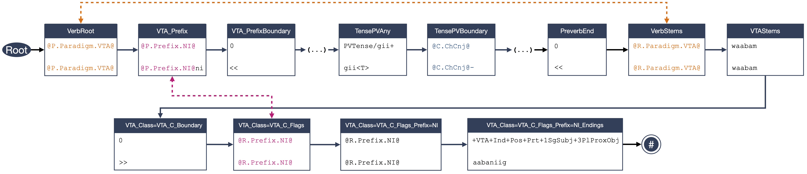

# FSTmorph
## What's inside
### The `csv2lexc.py` script
`csv2lexc.py` will generate `.lexc` files: one for each POS (e.g., `ojibwe_nouns.lexc`, `ojibwe_numerals.lexc`), and `root.lexc`.  It uses information from [the morphological source](./morphological_source.md) and [the lexical source](./lexical_source.md) to create these files.

For the details of how the script works (including its command-line args), check out [the developer docs](https://htmlpreview.github.io/?https://raw.githubusercontent.com/ELF-Lab/FSTmorph/dev/docs/html_docs/csv2lexc.html).

### The `assets/compile_fst.xfst` script
This script compiles the FST from `.lexc` and `.xsft` files.

`compile_fst.xfst` generally has file names hardcoded, because it doesn't take command-line arguments.  For this reason, there are some strict expectations about what the relevant files are called and where they are located (though you could always change these yourself by modifying `compile_fst.xfst` if you really wanted to).  Specifically:
- The `.lexc` info comes from a file named `all.lexc` in the same directory as `compile_fst.xfst`
- The phonological rules come from a file named `phonology.xfst` in the same directory as `compile_fst.xfst`
- The outputted FST files will be called `LANGUAGE_NAME.fomabin` and `LANGUAGE_NAME.att` and go in the same directory as `compile_fst.xfst`.

Because of these expectations, we have elected (in the Ojibwe example case) to copy both `phonology.xfst` and `compile_fst.xfst` into the output directory (where the `.lexc` files are already being generated), so that all these pieces are in the same directory.  The [`Makefile`](https://github.com/ELF-Lab/OjibweMorph/blob/dev/Makefile) in `OjibweMorph` therefore provides a great example of all these details in using `compile_fst.xfst`, but these steps are also outlined in more detail below.

#### Creating `all.lexc`
To create `all.lexc` used by `compile_fst.xfst`, you will need to combine all the `.lexc` files into this master `.lexc` file. This is done using the UNIX `cat` command.  An example is given below, and this also occurs in the [`Makefile`](https://github.com/ELF-Lab/OjibweMorph/blob/dev/Makefile) in `OjibweMorph`.

```
$ cd wherever_the_lexc_files_are_generated

# You can cat the files in almost any order but root.lexc always needs to be the first lexicon file. 
$ cat root.lexc prenouns.lexc preverbs.lexc ojibwe_verbs.lexc ojibwe_nouns.lexc ojibwe_irregular_verbs.lexc > all.lexc
```

#### Copying the `.xfst` files
Once `all.lexc` is created, you'll want to get the `.xfst` files in the same directory as well.  Again, check out the [`Makefile`](https://github.com/ELF-Lab/OjibweMorph/blob/dev/Makefile) in `OjibweMorph` for a real example of this, but a simple example is given below:

```
$ cp my_python_packages/fstmorph/assets/compile_fst.xfst FST/generated/compile_fst.xfst
```

Furthermore, we probably don't want our FST to have the default name `LANGUAGE_NAME.fomabin`.  To give a meaningful value to this variable, we can use `cat` instead:
```
$ cat my_python_packages/fstmorph/assets/compile_fst.xfst | sed 's/LANGUAGE_NAME/ojibwe/g' > FST/generated/compile_fst.xfst
```

This basically says: take all the content of `compile_fst.xfst` and throw it in a file also called `compile_fst.xfst` but in our output directory (`FST/generated/`).  Before writing the file there, first replace (`sed`) all instances of `LANGUAGE_NAME` with `ojibwe`. 

#### Running `compile_fst.xfst`
With `all.lexc`, `phonology.xfst`, and `compile_fst.xfst` itself all in our output directory, we can now call `compile_fst.xfst` to create the FST:
```
foma -f compile_fst.xfst
```

This generates two output files: 

* a binary FST file `LANGUAGE_NAME.fomabin` (e.g., `ojibwe.fomabin`), and
* an FST file in ATT text format `LANGUAGE_NAME.att` (e.g., `ojibwe.att`)

You can read either of these into `foma` to test them:

```
Testing ojibwe.fomabin:

$ foma

Foma, version 0.10.0
Copyright © 2008-2021 Mans Hulden
This is free software; see the source code for copying conditions.
There is ABSOLUTELY NO WARRANTY; for details, type "help license"

Type "help" to list all commands available.
Type "help <topic>" or help "<operator>" for further help.

foma[0]: load ojibwe.fomabin 
5.1 MB. 151484 states, 332934 arcs, Cyclic.
foma[1]: up waabam
waabam+VTA+Imp+Sim+2SgSubj+3SgProxObj
waabam+VTA+Imp+Sim+2SgSubj+3PlProxObj
```

```
Testing ojibwe.att:

$ foma

Foma, version 0.10.0
Copyright © 2008-2021 Mans Hulden
This is free software; see the source code for copying conditions.
There is ABSOLUTELY NO WARRANTY; for details, type "help license"

Type "help" to list all commands available.
Type "help <topic>" or help "<operator>" for further help.

foma[0]: read att ojibwe.att 
Reading AT&T file: ojibwe.att
5.1 MB. 151484 states, 332934 arcs, Cyclic.
foma[1]: up waabam
waabam+VTA+Imp+Sim+2SgSubj+3PlProxObj
waabam+VTA+Imp+Sim+2SgSubj+3SgProxObj
```

## How it works
### Verb lexicons
Let's examine an example verb `nigii-waabamaabaniig` which corresponds to the analysis `PVTense/gii+waabam+VTA+Ind+Pos+Prt+1SgSubj+3PlProxObj`. This form is a result of a morphophonological intermediate representation from the lexicon: `ni<<gii<T>-<<waabam>>aabaniig` which together with phonological rules gives the correct surface form (in this case, the rules simply delete the boundary markers `<<` and `>>` as well as delete the tense-rule trigger `<T>`).

The flowchart below illustrates how the analysis and morphophonological form are represented in the Ojibwe lexc lexicon. Each block represents an entry in lexc sublexicon (like `VerbRoot`). The block contains an upper (or analysis string) and a lower (or morpholphonological) string. The concatenation of these define the string-pair `PVTense/gii+waabam+VTA+Ind+Pos+Prt+1SgSubj+3PlProxObj:nigii-waabamaabaniig`: 


(click on the image to zoom in)

The sublexicons are:

1. `Root`: Generation always start here. This lexicon leads to word class-specific sublexicons like `VerbRoot`, `NounRoot`, `AdverbRoot`. The `Root` lexicon is located in the generated file `root.lexc`
2. `VerbRoot`: This lexicon leads to paradigm-specific person prefix lexicons e.g. `VTA_Prefix`. We use the flag diacritic `@P.Paradigm.VTA@` to mark this form as a VTA. We need to use a flag diacritic because the preverb lexicon is shared between multiple different verb paradigms and we need to make sure that we re-enter the stem lexicon. We continue to a person prefix lexicon. All verb-specific lexicons (apart from preverb lexicons) are located in the generated file `ojibwe_verbs.lexc`.
3. `VTA_Prefix`: The lexicon contains all person prefixes which are valid for VTAs (i.e. all of them `ni`, `gi`, `o` and the empty prefix). Here we get both the person prefix entry which is `ni` in this case and use the flag diacritic `@P.Prefix.NI@` to mark this as a ni-form. We continue to a morpheme boundary lexicon.
4. `VTA_PrefixBoundary`: Here we add a morpheme boundary on the lower side. From this lexicon, we continue to the PreverbRoot lexicon.
5. Multiple preverb lexicons: 
