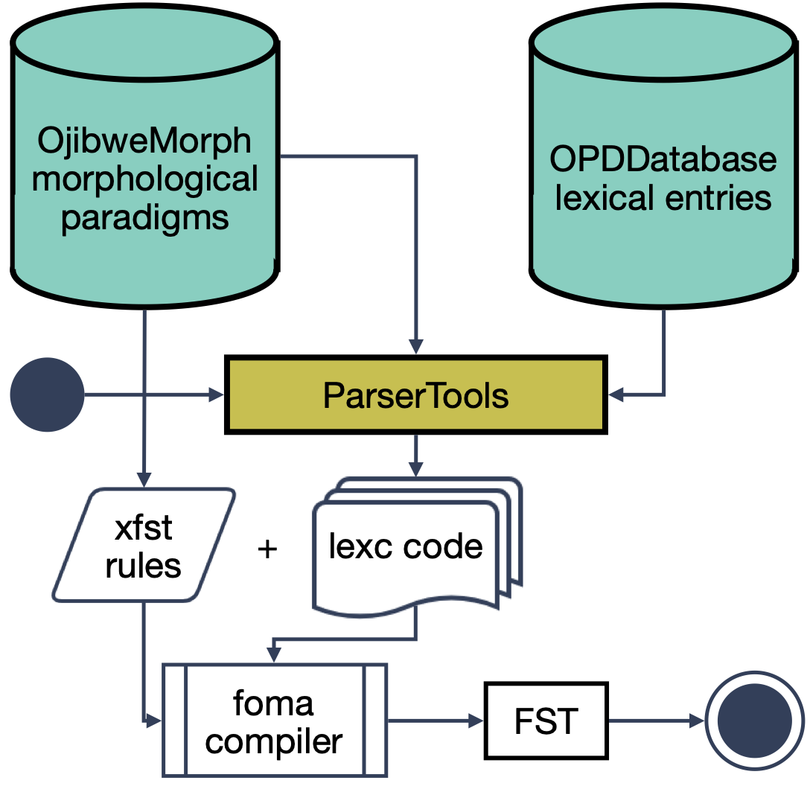

# FSTmorph
<mark>Under construction!</mark>

This project builds FST morphological analyzers based on human-readable and human-editable inflection tables and lexical databases. 

A morphological analyzer is a model which can do two things:

* Analyze an inflected word as a combination of a lemma and morphological features: `walked -> walk+Verb+Past`
* Generate inflected forms from a lemma and some morphological features: `walk+Verb+Past -> walked`

Traditionally morphological analyzers are implemented as finite-state transducers (FST). These have been shown to adequately model the inflectional processes for most if not all human languages. [Foma](https://fomafst.github.io) is one of the most popular tookits for compilation of FST morphological analyzers. It uses formalisms originally developed by Xerox to present **lexical information** (the *lexc* formalism) and **phonological rules** (the *xfst* formalism). The lexical component provides information about word stems, like `bake`, and affixes, like `-ed`. The phonological rule component determines how stems and affixes are combined into word forms. For example, for the combination `bake+ed`, the rules might delete the `e` in the affix, thereby, giving a valid English word form: `bake+ed -> bake+d -> baked`.

Lexc lexicons tend to get quite messy and hard to maintain when the lexicon grows, especially for morphologically complex languages like many of the Indigenous languages spoken in Canada and the U.S. Our project instead represents lexical information in a spreadsheet format which is easy to view, edit and maintain, even without extensive technical experience. The aim is to make FST development accessible for a broader range of developers and community members who do not necessarily need to be professional linguists or computational linguists. 

In summary, these **spreadsheets (CSVs)** are ultimately compiled into **lexc code** and then compiled into an **FST model** using the `foma` toolkit.  

## Compilation of the FST at a glance

The FST analyzer is built using three sources:

* A morphological source which houses morphological paradigms, skeleton `lexc` code and the `xfst` phonological rewrite rules.  For the example Ojibwe FST, this is [OjibweMorph](https://github.com/ELF-Lab/OjibweMorph).
* A lexical source containing lemmas (in CSVs) that will be known by the FST.  For the example Ojibwe FST, this is [OjibweLexicon](https://github.com/ELF-Lab/OjibweLexicon).
* FSTmorph, which houses the code for compiling `lexc` files from the source data given by the other sources.

This division into three components makes this tool more modular and therefore easier to adapt to different languages (or simply different dialects of Ojibwe).  

The content in the morphological source alone -- the spreadsheets, configuration files and `xfst` rules -- can be used to compile a very minimal FST.  In the case of the Ojibwe example, this means that OjibweMorph can be used without OjibweLexicon and still produce a small FST which can analyze and generate the forms for twenty-odd Ojibwe model lexemes. For a full-scale morphological analyzer which can analyze most Ojibwe words in running text, the lexical database is needed.  OjibweLexicon contains lexical data from various sources, including [the Ojibwe People's Dictionary (OPD)](https://github.com/ELF-Lab/OjibweMorph) and fieldwork.

To give some more detail, the script `csv2lexc.py` here in FSTmorph utilizes (1) morphological paradigms for nouns, verbs and other word classes from `OjibweMorph` (2) a database of lexical information from `OjibweLexicon` and (3) configuration files for compiling `lexc` code in OjibweMorph. It then generates a set of `lexc` files which are combined with `xfst` rules manually specified in `OjibweMorph` using the `foma` toolkit. Ultimately, foma saves the result as an FST.

## User documentation
1. [Intro to FSTs](fst.md)
2. [The Morphological Source](morphological_source.md)
3. [The Lexical Source](lexical_source.md)
4. [FSTmorph](FSTmorph.md)
5. [Example Use: Adding a New Part-of-Speech (POS)](adding_pos.md)
5. [Useful References](references.md)

## Developer documentation

1. [`ParserTools/FSTmorph`](https://htmlpreview.github.io/?https://github.com/ELF-Lab/ParserTools/blob/dev/docs/html_docs/index.html)
