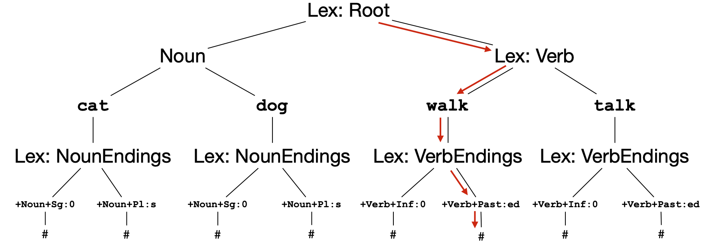

# Intro to FSTs
This discussion is a highly abbreviated version of the discussion in [the Foma morphological analysis tutorial](https://fomafst.github.io/morphtut.html).

FSTs (finite-state transducers) are models which map between two different set of strings `upper:lower`. The **upper** string represents a morphological analysis like `walk+Verb+Past` and the **lower** string represents the corresponding inflected word form `walked`. The FST can map a lower word form into an upper analysis `walked -> walk+Verb+Past`. This is called **analysis** or **lookup**. It can also perform a mapping in the inverse direction `walk+Verb+Past -> walked`. This is called **generation** or **lookdown**.

## Lexc lexicons

As discussed in the [morphology document](morphology.md), word forms like `walked` consist of a stem `walk` and inflectional affixes `-ed`. A **lexc lexicon** specifies stems for different word classes and their various affixes:
```
! The Multichar_Symbols section lists string which should
! be treated as atomic tags.
Multichar_Symbols

! Word classes
+Noun +Verb

! Noun morphological features: singular and plural
+Sg +Pl

! Verb morphological features: infinitive and past
+Inf +Past

!!!!! End of Multichar_Symbols !!!!!

LEXICON Root
! A unique Root lexicon is always required. This represents
! the root of the lexicon tree. All forms start here.
Noun ;  
Verb ; ! When there is only one entry on the lexicon line,
       ! it refers to a continuation lexicon

LEXICON Noun
! Here, we get the stem "dog" which also doubles as a lemma.
! The rest of the form can be found in the continuation
! lexicon NounEnding
dog NounEnding ; 
cat NounEnding ;

LEXICON Verb
walk VerbEnding ;
talk VerbEnding ;

LEXICON NounEnding
! When the upper and lower string differ, they need to be separated
! by a colon ":". The upper (analysis) string is written on the left
! and the lower (word form) string on the right.
+Noun+Sg:0 # ; 
+Noun+Pl:s # ; ! '#' marks that the word form ends here.

LEXICON VerbEnding
+Verb+Inf:0 # ;
+Verb+Past:ed # ;
```

This lexc file recognizes the following analysis–word form pairs:

```
talk+Verb+Past	talked
talk+Verb+Inf	talk
walk+Verb+Past	walked
walk+Verb+Inf	walk
cat+Noun+Pl	cats
cat+Noun+Sg	cat
dog+Noun+Pl	dogs
dog+Noun+Sg	dog
```

Logically, the lexc file can be represented as a tree-structure:



Each analysis–word form pair `walk+Verb+Past:walked` corresponds to a unique path from the root node to a terminal node `#` in the tree representing our lexc file. We can, therefore, also think of the lexc file as encoding a set of paths starting at the `Root` lexicon and ending in `#`:

```
(LEXICON Root, LEXICON Verb, walk, LEXICON VerbEnding, +Verb+Past:ed, #)
```

This is the approach taken in the `ParserTools/csv2fst` code.

## Flag diacritics

While it is always possible to implement a lexicon as a basic lexc file following the format above, this ca sometimes lead to very large lexicon files. This happens when the word forms contain long-distance dependencies. For example, the following Ojibwe verb forms differ only with regard to the subject:

```
niimi+VAI+Ind+Pos+Neu+ExclSubj    niniimimin
niimi+VAI+Ind+Pos+Neu+2PlSubj     giniimim
```

As expected, the person prefix changes from `ni` to `gi`, when the subject changes, but we also see a change in the suffix from `-min` to `m` (the stem is `niimi`). This means that there is a **long-distance dependency** spanning over the stem in the word form. Normally, this would require us to duplicate the stem-lexicon in the lexc file in order to avoid the illegal combinations `niniimim` and `giniimimin` (`Multichar_Symbols` section omitted):

```
LEXICON Root
Prefix ;

LEXICON Prefix
0:gi GiStem ;
0:ni NiStem ;

LEXICON GiStem
niimi GiEnding ;

LEXICON NiStem
niimi NiEnding ;

LEXICON GiEnding
+VAI+Ind+Pos+Neu+2PlSubj:m # ;

LEXICON NiEnding
+VAI+Ind+Pos+Neu+ExclSubj:min # ;
```

When there are many stems (and there can be thousands) as well as several prefix-suffix combinations to keep track of, repeated copies of the stem lexicon become cumbersome and hard to maintain. Luckily, lexc offers and alternative mechanism to control the lexicon combinatorics, namely, **flag diacritics**.

The `ni` prefix sets the `Prefix` feature to the value `ni` using the flag `@P.Prefix.NI@`. This flag is then checked in the `NiEnding` lexicon using flag `@R.Prefix.Ni@`:

```
LEXICON Root
Prefix ;

LEXICON Prefix
@P.Prefix.Gi@ GiPrefix ;
@P.Prefix.Ni@ NiPrefix ;

LEXICON NiPrefix
0:ni Stem ;

LEXICON GiPrefix
0:gi Stem ;

LEXICON Stem
niimi Ending ;

LEXICON Ending
@R.Prefix.Gi@ GiEnding ;
@R.Prefix.Ni@ NiEnding ;

LEXICON GiEnding
+VAI+Ind+Pos+Neu+2PlSubj:m # ;

LEXICON NiEnding
+VAI+Ind+Pos+Neu+ExclSubj:min # ;
```

Note that the same could be represented more compactly using fewer continuation lexicons, but this can impede readability:

```
LEXICON Root
@P.Prefix.Gi@:@P.Prefix.Gi@ni Stem ;
@P.Prefix.Gi@:@P.Prefix.Gi@gi Stem ;

LEXICON Stem
niimi Ending ;

LEXICON Ending
@R.Prefix.Gi@+VAI+Ind+Pos+Neu+2PlSubj:@R.Prefix.Gi@m # ;
@R.Prefix.Ni@+VAI+Ind+Pos+Neu+ExclSubj:@R.Prefix.Ni@min # ;

```

List of flag diacritics:

TBD
